# Sprawozdanie z projektu 2 - E: Log forwarding: Linux

**Cel:** Ustanowienie bezpiecznego, szyfrowanego kanału komunikacji (TLS) pomiędzy maszyną kliencką (Nadawca) a centralnym serwerem logów (Odbiorca), zgodnie z wytycznymi hardeningu CIS. Konfiguracja obejmuje integrację systemu Audit z usługą RSyslog oraz weryfikację zdalnego logowania.

---

## 1. Konfiguracja zaawansowanego auditingu zgodnego z benchmarkami CIS

W ramach realizacji zadania wdrożono zaawansowany auditing oraz bezpieczne przesyłanie logów, spełniając wymagania CIS Benchmark dla RHEL 10.

### 6.1 Integralność i ochrona narzędzi audytu

**6.1.1 Instalacja AIDE**
Zainstalowano system sprawdzania integralności plików.
*Weryfikacja:* `dnf list installed aide`

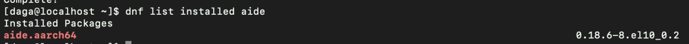

**6.1.3 Ochrona narzędzi audytu**
Narzędzia takie jak `auditctl` czy `auditd` zostały dodane do bazy AIDE, aby monitorować ich sumy kontrolne SHA512.
*Weryfikacja:* `grep -E "auditctl|auditd" /etc/aide.conf`

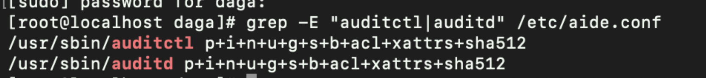

### 6.2 Przekazywanie zdarzeń do RSyslog

Konfiguracja ta pozwala na przechwycenie logów z dziennika systemowego i wysłanie ich do centralnego serwera.

**6.2.3.2 Aktywność usługi RSyslog**
Usługa jest włączona i przesyła dane w czasie rzeczywistym.
*Weryfikacja:* `systemctl is-active rsyslog`

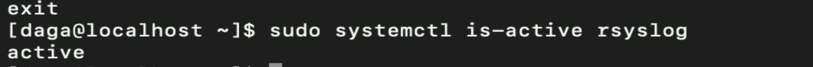

**6.2.3.3 Integracja Journald z RSyslog**
Włączono parametr `ForwardToSyslog`, co pozwala RSyslogowi na pobieranie logów z modułu imjournal.
*Weryfikacja:* `grep "^ForwardToSyslog=yes" /etc/systemd/journald.conf`

**6.2.3.4 Konfiguracja trybu tworzenia plików logów (FileCreateMode)**
Ustawienie uprawnień `0640` chroni lokalne kopie logów przed nieuprawnionym odczytem.
*Weryfikacja:* `grep $FileCreateMode 0640" /etc/rsyslog.conf /etc/rsyslog.d/*.conf`

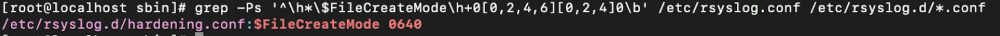

**6.2.3.6 Zdalne logowanie (Log Forwarding)**
Skonfigurowano akcję `omfwd` kierującą logi na IP Odbiorcy przez port 6514.
*Weryfikacja:* `grep "action(type=\"omfwd\"" /etc/rsyslog.conf`

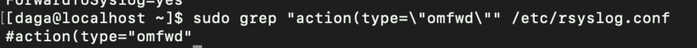

### 6.3 Zaawansowane reguły audytu

Reguły audytu zostały zorganizowane tematycznie w osobnych plikach konfiguracyjnych w katalogu `/etc/audit/rules.d/`, zgodnie z zaleceniami CIS Benchmark. Każdy plik odpowiada za inną klasę zdarzeń (zarządzanie użytkownikami, eskalacja uprawnień, integralność systemu). Reguły są ładowane automatycznie przy starcie systemu (augenrules).

Aktywność reguł została potwierdzona poleceniem `auditctl -l`.

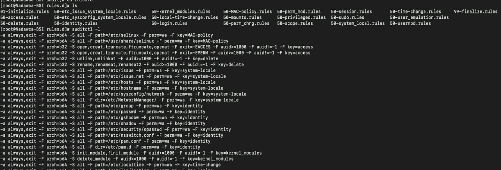

**6.3.1.4 Aktywność usługi Auditd**
Demon audytu działa i generuje wpisy dla zdarzeń systemowych.
*Weryfikacja:* `systemctl is-active auditd`

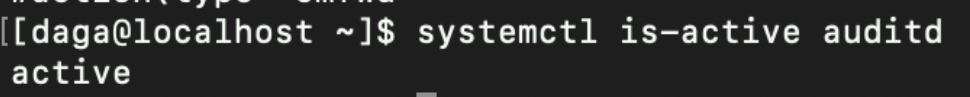

**6.3.3.10 Monitorowanie poleceń uprzywilejowanych**
Rejestrowane jest każde użycie komendy sudo (i innych uprzywilejowanych).
*Weryfikacja:* `find /etc/audit/rules.d/ -type f -exec grep -l "privileged" {} +`

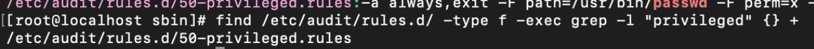

**6.3.3.13 Monitorowanie bazy użytkowników**
Każda zmiana w pliku `/etc/passwd` (np. przez useradd) generuje ślad audytowy.
*Weryfikacja:* `grep "passwd" /etc/audit/rules.d/*.rules`

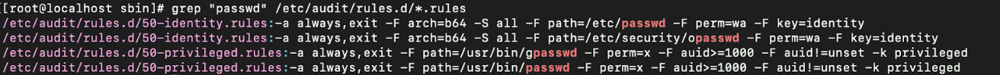

**6.3.2.2 Zapobieganie automatycznemu usuwaniu logów**
Konfiguracja zapobiega utracie dowodów w przypadku przepełnienia logów (`keep_logs`).
*Weryfikacja:* `grep max_log_file_action /etc/audit/auditd.conf`

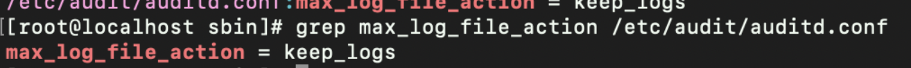

**6.3.3.36 Niezmienność konfiguracji**
Zablokowano możliwość zmiany reguł audytu bez restartu systemu (parametr `-e 2`).
*Weryfikacja:* `grep -Ph -- '^\h*-e\h+2\b' /etc/audit/rules.d/*.rules | tail -1`

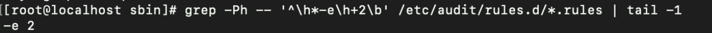

---

## 2. Konfiguracja RSyslog do pracy z TLS (Sekcja 6.2.3.6)

Ten etap odpowiada za bezpieczne "wypchnięcie" logów na zewnątrz. Konfiguracja po stronie Nadawcy (Rocky 10) dzieli się na dwa główne bloki.

**Plik:** `/etc/rsyslog.d/90-forwarding.conf`

### 2.1. Blok Globalny (global)

Odpowiada za ustawienia wspólne dla całego procesu rsyslog:

- **DefaultNetstreamDriver="gtls":** Definiuje użycie sterownika GnuTLS. Jest to niezbędne, aby rsyslog potrafił obsługiwać szyfrowanie (standardowy sterownik obsługuje tylko czysty tekst).
- **DefaultNetstreamDriverCAFile:** Wskazuje na "zaufany urząd" (Root CA). To ten plik sprawdza, czy certyfikat serwera jest autentyczny.
- **DefaultNetstreamDriverCertFile / KeyFile:** Dokumenty tożsamości (certyfikat i klucz prywatny), którymi Nadawca przedstawia się Serwerowi.

### 2.2. Blok Akcji (action)

Definiuje parametry konkretnej wysyłki danych:

- **type="omfwd":** Akcja wysyłki (Output Module Forward).
- **target / port / protocol:** Adres IP serwera, port TLS (6514) i protokół TCP.
- **StreamDriverMode="1":** Wymusza tryb TLS. Zapobiega to przesyłaniu logów tekstem jawnym, jeśli serwer by na to pozwolił.
- **StreamDriverAuthMode="x509/name":** Najwyższy tryb weryfikacji. Nadawca sprawdza podpis CA oraz czy nazwa w certyfikacie zgadza się z listą dozwolonych partnerów.
- **StreamDriverPermittedPeers="nadawca-rocky10":** Jeśli serwer przedstawi certyfikat z inną nazwą, połączenie zostanie zerwane w obawie przed atakiem typu Man-in-the-Middle.

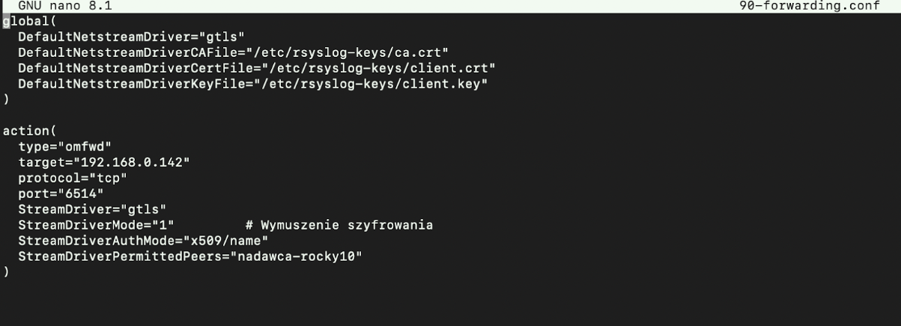

---

## 3. Przekazywanie zdarzeń audytowych w czasie rzeczywistym

Na maszynie klienckiej skonfigurowano zaawansowany mechanizm audytu systemowego oparty o usługę auditd, działającą w trybie niezmiennym (immutable), zgodnie z wymaganiami CIS. Poprawność działania mechanizmu audytu została potwierdzona poleceniem auditctl -s, które wykazało aktywny audyt w trybie wymuszonym (enabled = 2).

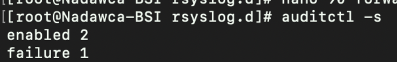

W celu umożliwienia przekazywania zdarzeń audytowych poza system lokalny, wykorzystano wbudowaną integrację auditd z mechanizmem syslog. System audytu został skonfigurowany do eksportowania zdarzeń poprzez plugin builtin_syslog, co potwierdzono analizą pliku konfiguracyjnego /etc/audit/plugins.d/syslog.conf, w którym ustawiono parametr active = yes. Takie podejście pozwala na przekazywanie zdarzeń audytowych bezpośrednio do systemowego mechanizmu logowania.

W celu przekazywania zdarzeń poza system lokalny, wykorzystano plugin `builtin_syslog`.
*Weryfikacja:* Plik `/etc/audit/plugins.d/syslog.conf` (`active = yes`).

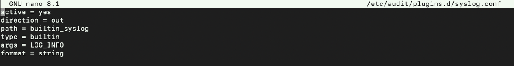

Zdarzenia przekazane do sysloga są następnie rejestrowane w systemie journald, który został skonfigurowany do dalszego przekazywania logów do usługi RSyslog. Ustawienie to zostało zweryfikowane poprzez sprawdzenie parametru ForwardToSyslog=yes w pliku /etc/systemd/journald.conf. Dzięki temu journald pełni rolę pośrednika, zapewniając spójność i buforowanie zdarzeń systemowych.

Zdarzenia są rejestrowane w journald (forwarding włączony):
*Weryfikacja:* `grep "^ForwardToSyslog=yes" /etc/systemd/journald.conf`

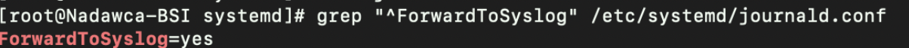

Usługa RSyslog została skonfigurowana do pobierania zdarzeń z journald przy użyciu modułu imjournal, co potwierdzono obecnością dyrektywy module(load="imjournal") w plikach konfiguracyjnych RSyslog. Mechanizm ten umożliwia przechwytywanie zdarzeń audytowych w czasie rzeczywistym, bezpośrednio po ich zapisaniu w journald.

Usługa RSyslog pobiera zdarzenia z journald przy użyciu modułu `imjournal`.
*Weryfikacja:* `grep -R "imjournal" /etc/rsyslog.conf /etc/rsyslog.d/*.conf`

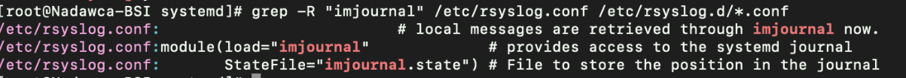

---

## 4. Konfiguracja Odbiorcy (RHEL 10)

**Plik:** `/etc/rsyslog.d/remote.conf`

Odbiorca nasłuchuje na dedykowanym bezpiecznym porcie 6514/TCP. Ten plik zamienia serwer w "bezpieczną bazę" przyjmującą dane:

- **module(load="imtcp" ...):** Ładuje moduł wejścia (Input Module TCP) z obsługą TLS.
- **StreamDriver.Authmode="anon":** Oznacza autoryzację anonimową w kontekście nazwy. Serwer sprawdzi, czy Nadawca ma ważny certyfikat podpisany przez wspólne CA, ale nie będzie sprawdzał konkretnego "imienia" (CN) klienta. Pozwala to na łatwe dołączanie wielu klientów bez zmiany konfiguracji serwera.
- **input(type="imtcp" port="6514"):** Otwiera "gniazdo" (socket) i czeka na przychodzące bezpieczne połączenia.

### 4.1. Szablony Dynamiczne

Zastosowano sposób zapisu danych:

- **%HOSTNAME%:** RSyslog automatycznie tworzy podfolder o nazwie maszyny nadawcy (np. `/Nadawca-BSI/`).
- **%PROGRAMNAME%:** Rozdziela logi na osobne pliki (np. `sudo.log`, `useradd.log`), co znacząco ułatwia audyt.
- **action(type="omfile" dynaFile="RemoteLogs"):** Przekazuje rsyslogowi, aby wszystkie odebrane logi zapisał na dysku, używając powyższego szablonu dynamicznego.

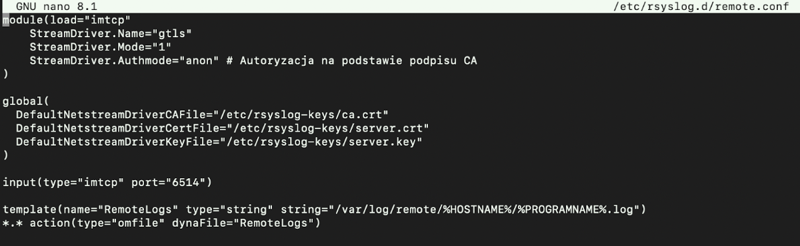

---

## 5. Weryfikacja i działania sankcjonowane

Przeprowadzono testy "end-to-end" potwierdzające działanie łańcucha logowania.

### 1. Akcja na Nadawcy

Wykonano komendę `sudo useradd projekt_bsi`.

**Mechanizm:**  
Jądro systemu wygenerowało zdarzenie audytowe, które zostało przechwycone przez mechanizm `auditd`, następnie przekazane do systemu `journald` i obsłużone przez usługę RSyslog, która wysłała je tunelem TLS do serwera centralnego.

**Weryfikacja u Odbiorcy:**  
- Sprawdzono katalog `/var/log/remote/Nadawca-BSI/`.
- Potwierdzono obecność pliku `useradd.log` z wpisem o stworzeniu użytkownika.

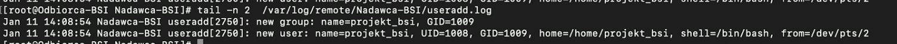

### 2. Akcja na Nadawcy (eskalacja uprawnień)

Wykonano polecenie: `sudo -i`

**Mechanizm:**  
Użycie polecenia sudo wygenerowało zdarzenie audytowe związane z eskalacją uprawnień. Zdarzenie zostało przechwycone przez RSyslog i przesłane szyfrowanym kanałem TLS do serwera centralnego.

**Weryfikacja u Odbiorcy:**  
Potwierdzono obecność wpisu dotyczącego użycia polecenia sudo w pliku:  
`/var/log/remote/Nadawca-BSI/sudo.log`

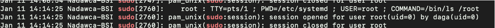

### 3. Akcja na Nadawcy (test manualny – logger)

Wykonano polecenie:  
`logger -p authpriv.notice "BSI test – zdarzenie audytowe logger"`

**Mechanizm:**  
Polecenie logger wygenerowało wpis w mechanizmie syslog, który został przechwycony przez system journald, a następnie obsłużony przez usługę RSyslog. Zdarzenie zostało przesłane w czasie rzeczywistym do centralnego serwera logów przy użyciu szyfrowanego połączenia TLS.

**Weryfikacja u Odbiorcy:**  
Sprawdzono logi zapisane w katalogu:  
`/var/log/remote/Nadawca-BSI/`  

Potwierdzono obecność wpisu testowego w pliku:  
`root.log`

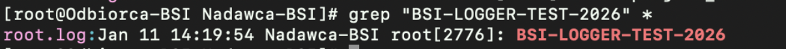

---

## 6. Wnioski

Zadanie wykonano zgodnie z wymogami bezpieczeństwa. Połączenie jest odporne na podsłuch (szyfrowanie TLS) oraz na próby podszycia się pod serwer logów. Logi są składowane w sposób scentralizowany i uporządkowany, co spełnia rygorystyczne normy CIS.

